# CAD as Config

**Git-backed, parametric CAD with a coding agent — what actually works, what doesn't, and the pattern we now use for every fixture in the shop.**

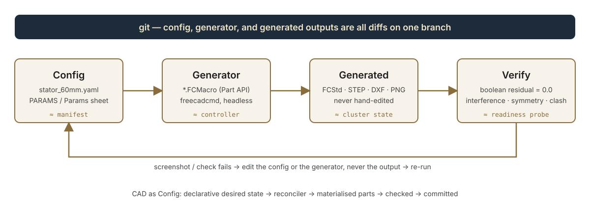

---

## 1. The concession first

A lot of people have tried to get an LLM agent to "do CAD," and most of them have come away disappointed. We were among them, at first. Let's be honest about why, because the failure modes are the whole reason the pattern in this post is shaped the way it is.

**You cannot ask an agent to make you a CAD model of an airliner.** Or a winding machine. Or even a "bracket for this motor," if that's all you say. It will produce *something* — a box with holes, a plausible-looking screenshot in your head — and it will be wrong in the ways that matter: wrong datum, wrong side, wrong hand, interfering with the part next to it, un-manufacturable. Not because the model is dumb, but because:

- **CAD tools are GUI-first.** The mainstream tools expose their power through mouse gestures, feature trees and constraint solvers that were never meant to be driven by text. An agent poking at a GUI is a bad typist with no hands.
- **The agent has no spatial feedback loop.** It cannot look at the model, notice the flange is on the wrong face, and fix it — unless you build it that loop.
- **The output is unverifiable prose.** "I have created a mounting plate with four holes" is a claim, not a check. If nothing measures the result, the agent will happily be confidently wrong.
- **The problem is under-specified.** "A plate for the HRP85" hides fifty decisions (thickness, clearance, which face, which bolt circle, which way the cable exits) that a human designer makes from context the agent doesn't have.

So the honest headline is: **an agent cannot design a machine for you from a sentence.** What it *can* do — extremely well, and better than most humans at the keyboard — is turn a *constrained, decomposed, measurable* geometry problem into a *program that generates the geometry*, and then iterate on that program with you at the speed of conversation.

That reframing is the whole trick. You stop asking for models and start asking for **generators**. Once the CAD is a program, everything we already know about working with agents on code applies: parameters, tests, diffs, branches, review, regeneration. The model becomes an artifact — like a compiled binary — and the *source* is what you own.

We call it **CAD as Config**.

---

## 2. Where the name comes from: config-as-code, and Kubernetes in particular

Infrastructure went through this exact transition fifteen years ago. Nobody clicks around a cloud console to build a production cluster any more. You write a **declarative manifest** describing desired state, a **controller** reconciles the world to match it, the resulting **live state** is inspectable but never hand-edited, and the manifest lives in git so it can be diffed, reviewed and rolled back. Kubernetes made that model mainstream; Terraform, Ansible and friends made it universal.

The parallel to CAD is almost one-to-one:

| Config-as-code (Kubernetes) | CAD as Config (our shop) |
|---|---|
| Manifest (`deployment.yaml`) | Config (`stator_60mm.yaml`, a `PARAMS` dict, a `Params` spreadsheet) |
| Controller / reconciler | Generator macro (`ArborGenerator_v4.FCMacro`, `HRP85_PlateGenerator.FCMacro`) |
| Live cluster state | `generated/` — FCStd, STEP, DXF, PNG. Regenerable, never hand-edited |
| `kubectl apply` | `freecadcmd macros/Foo.FCMacro` (headless) |
| Readiness / liveness probes | Verification scripts: boolean residual, interference, symmetry, fixture clash |
| CRD schema | The YAML keys a generator promises to consume (`outer_diameter`, `side_guide.tip_gap`, …) |
| One manifest, many controllers | One stator YAML feeds the lamination cutter, the winding arbor, the wire guides **and** the coating jig |
| GitOps: PR = review the diff | PR = review the *config* diff (and the regenerated STEP if you want) |

The point of the analogy isn't cleverness. It's that the discipline it imposes — **desired state is declarative, the reconciler is code, the output is disposable, everything is in git** — is exactly the discipline that makes an agent useful on CAD. Every one of the failure modes in §1 is a symptom of doing the opposite.

---

## 3. The worked example: one stator YAML, four downstream parts

We make BLDC stators — S32 through S100 in the current lineup — and we build our own tooling to wind, coat and handle them. Every piece of that tooling depends on the *same* few numbers about the stator: outer diameter, bore, slot count, tooth shoe width. So that's where the config lives: one YAML per stator SKU, in our stator-design repo. Trimmed to what matters for this post:

```yaml
# input/stator_60mm_24n_config.yaml (excerpt)
outer_diameter: 60.0          # OD at tooth tips
inner_diameter: 36.65         # bore
slot_count: 24
tooth_width: 2.2
shoe_width: 5.0               # chord width at the tooth tip
shoe_depth: 1.3

corner_radii:
  slot_bottom_radius: 0.8
  slot_opening_radius: 0.3

pins:                         # alignment divots on the OD
  - angle: 0
    diameter: 1.5

# ── Side Wire Guides (fly winder) ─
# Consumed by macros/SideGuideGenerator.FCMacro.
# tip_gap: total opening between the two guide-wing tips - the
# funnel the fly lays wire through. Default shoe_width + 1.0.
side_guide:
  tip_gap: 6.00
```

Notice the last block. It was *added later*, by the agent, when the winding-guide generator needed a per-SKU tuning knob. That's the CRD-schema idea: a downstream generator can *extend* the config with the keys it needs, and the config stays the single source of truth.

Four independent generators consume that file today.

### 3a. The lamination (2D) — `stator_gen.py`

A plain Python script (no FreeCAD needed) reads the YAML and emits DXF + SVG for laser/EDM/stamping, plus a dimensioned drawing. This is the *first* consumer and the one that anchors all the others: if the bore in the YAML changes, everything below moves with it.

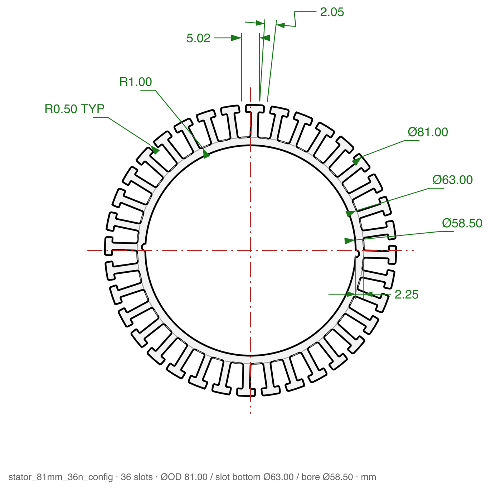

```sh
uv run python stator_gen.py -c input/stator_81mm_36n_config.yaml -f both
```

### 3b. The winding arbors — `ArborGenerator_v4.FCMacro`

The stator sits on an arbor during winding; the arbor sits in a riser; the riser bolts to the output table of an HRP85 hollow rotary platform. The generator builds the whole family: two riser classes (small / large stator), and one arbor per SKU per stack length (10, 20, 40 mm). Bore sizes and divot angles come *from the YAML lineup*, so the anti-rotation plunger holes clock to the real divots.

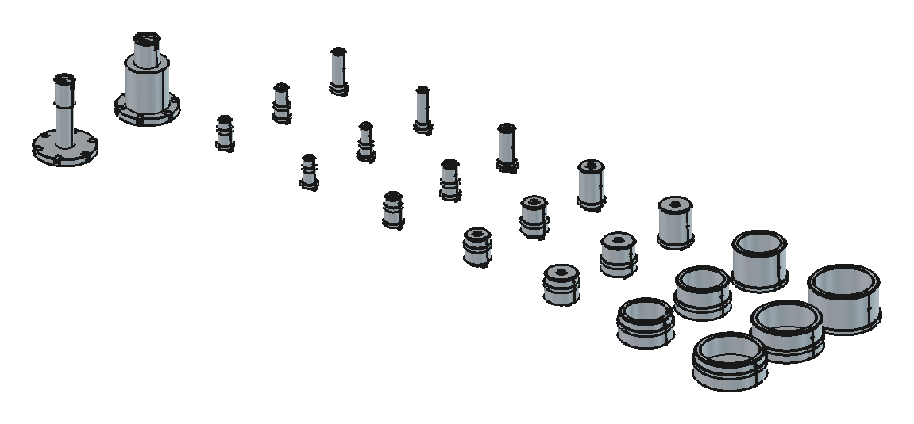

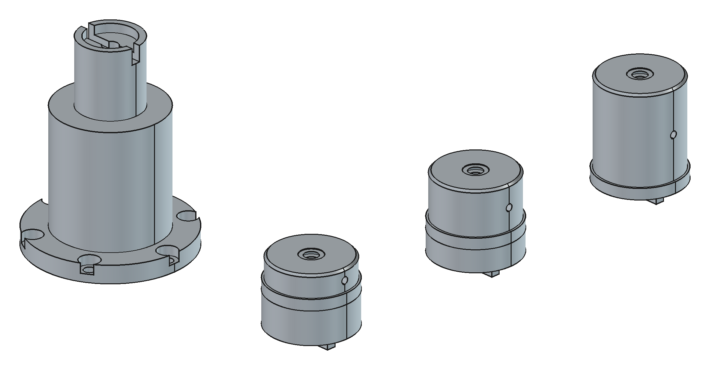

Parameters here live in a FreeCAD `Params` spreadsheet the macro creates on first run — globals at the top (HRP85 table OD, bore, bolt circle, riser height, cup interface diameters, `build` selector) and a per-stator table below. Same idea as the YAML; the spreadsheet is just a config format that's editable inside FreeCAD by someone who doesn't want to open a text editor.

```python
GLOBALS = [
    ("hrp_table_od",      70.00, "HRP85 output table OD (0/-0.02)"),
    ("hrp_bore",          33.00, "HRP85 hollow bore"),
    ("hrp_bcd",           62.50, "bolt circle on output table"),
    ("riser_height",      90.00, "riser total height (flange bottom to top rim)"),
    ("center_height",     25.00, "stack CENTERLINE above riser top face -- constant across all SKUs"),
    ("stack_lengths",   "10,20,40", "stack heights: one arbor per value"),
    ("model_threads",      1,    "1 = model helical threads (arbors), 0 = plain holes"),
    ("build",             "ALL", "ALL, stator name (S32), or variant (S32_L10)"),
]
```

That `center_height` line is worth dwelling on. It encodes a *machine-level* constraint (every stator's stack centreline must land at the same height so the flyer and guides never move) as a single number, and the generator derives each arbor's neck length from it. That's the kind of decision a human makes once and an agent then honours forever.

### 3c. The side wire guides — `SideGuideGenerator.FCMacro`

The fly winder lays wire past the stator through a funnel formed by two guide wings. The wing profile is literally the stator's tooth-tip geometry, offset by wire clearance, and the funnel opening is `side_guide.tip_gap` from the YAML. The generator scans the YAML directory, builds a station per SKU, and reports whether the guide clashes with the riser/arbor for that SKU.

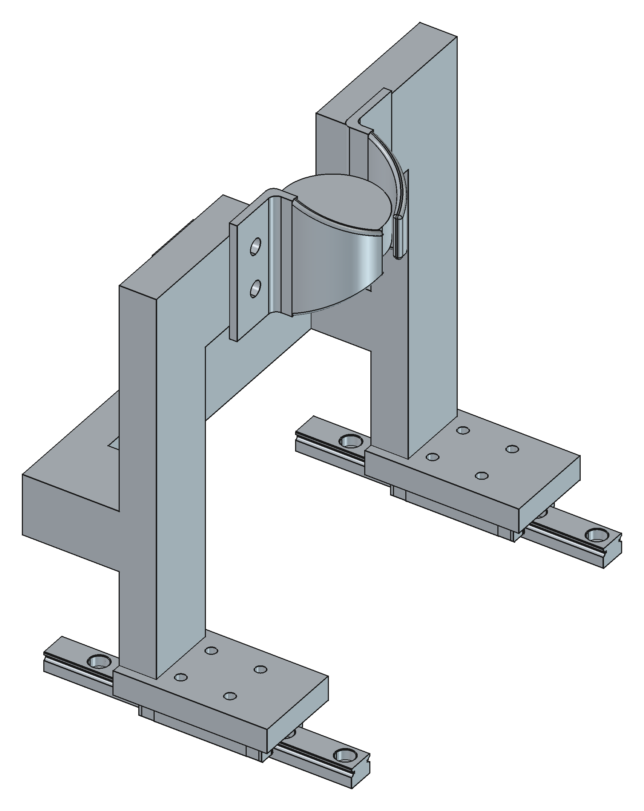

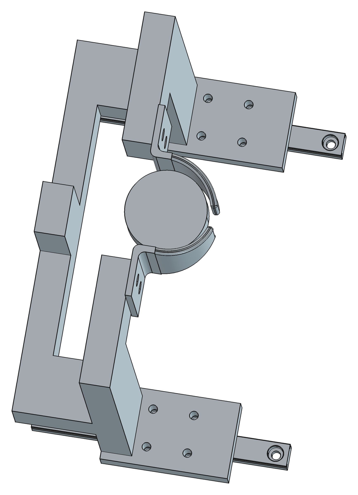

The YAML reader is deliberately boring — a regex over a handful of keys, tolerant of everything else in the file — because a generator should never be the thing that breaks when someone adds a winding pattern to the stator config:

```python
def scan_yaml_dir():
    rows = []
    pat = re.compile(r"^\s*(outer_diameter|slot_count|shoe_width|tip_gap)"
                     r"\s*:\s*([0-9.]+)", re.M)
    for fn in sorted(os.listdir(YAML_DIR)):
        if not fn.endswith((".yaml", ".yml")):
            continue
        d = dict(pat.findall(open(os.path.join(YAML_DIR, fn)).read()))
        if "outer_diameter" not in d:
            continue
        od = float(d["outer_diameter"])
        rows.append(["S%g" % round(od), od, 10.0,
                     int(float(d.get("slot_count", 12))),
                     float(d.get("shoe_width", 0.0)),
                     float(d.get("tip_gap", 0.0))])
    return rows
```

### 3d. The coating jig — `StatorJigGenerator.FCMacro` (Epoxy-Machine repo)

Completely different machine, different repo, same lineup. The powder-coat line carries stators on a through-bore brass rod with a self-clamping plastic mask on each face. The mask register spigot is sized from the stator bore; the rod is chosen from the bore too (Ø10 for the small SKUs, Ø18 for the large). One arm design ×2 per jig, one coupler for every size — because "one part number × volume" is cheaper than "seven part numbers × a few," and that DFM decision is *in the generator*, not in someone's head.

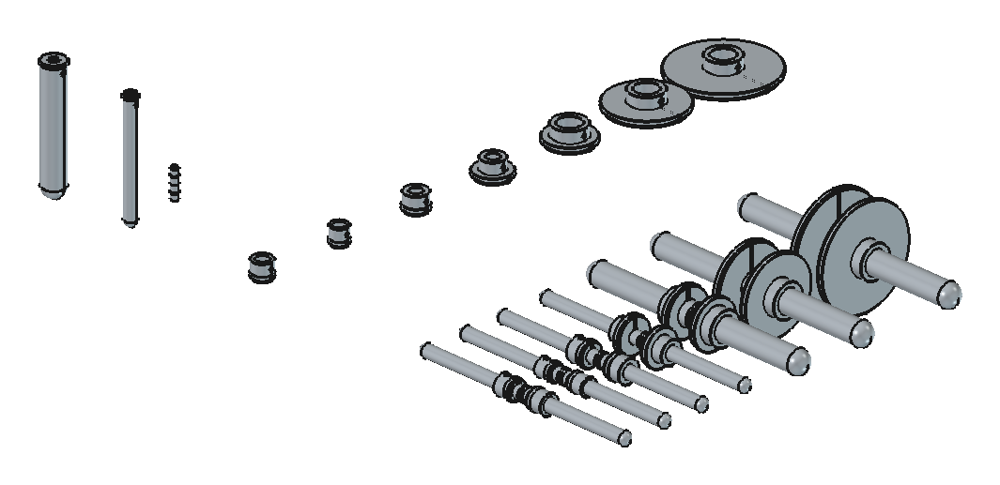

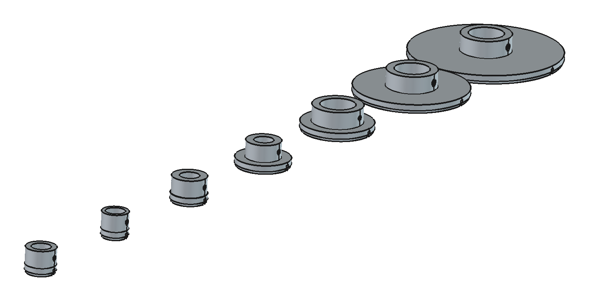

Four generators, three repos, one source of truth. Change `inner_diameter` on the S60 and the lamination, the arbor, the guide clash check and the coating mask all move — the next time someone runs the generators, which is exactly the GitOps promise.

---

## 4. The machine-scale example: HRP85 plates

The stator parts above are small and mostly round. The pattern holds up at machine scale too, and that's where the "you can't ask for an airliner" lesson really bites — so here is how we *decomposed* a winder into agent-sized problems.

The fly winder is built around two HRP85 hollow rotary platforms for the fly and two more for the spindles. The **first** thing we did was not "model the winder." It was:

1. Import the vendor STEP of the HRP85 and **measure it** with the agent: where is the output face, where does the square base end, what's the flange bolt pattern, where is the NEMA23 block. Those numbers went into a memory file and the top of the macro as named constants.
2. Define the **local frame** for one HRP85 (output axis +Z, flange face Z=0, platform face Z=32.2, base ends Z=11) and never argue about it again.
3. Ask for **one plate**: a flat sheet, two HRP85s at 180 mm centres, silhouette cutouts so the hollow bore stays open. Verify. Commit. (Parts are built in their own fab frame — plate face = XY — and only the assembly document is re-expressed in the machine frame, +Z up, −Y toward the operator. Getting *that* rotation right took two rounds of "rear should be top".)
4. Then a bend. Then side plates. Then deck holes. Then the spindle plate. Then linear axes. Each one a small diff on a working generator.

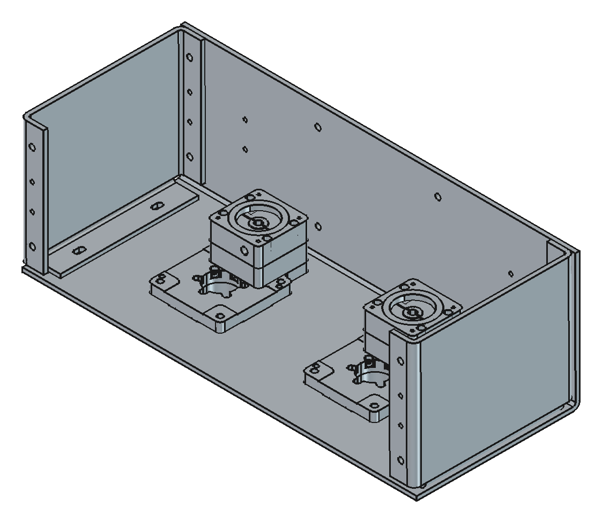

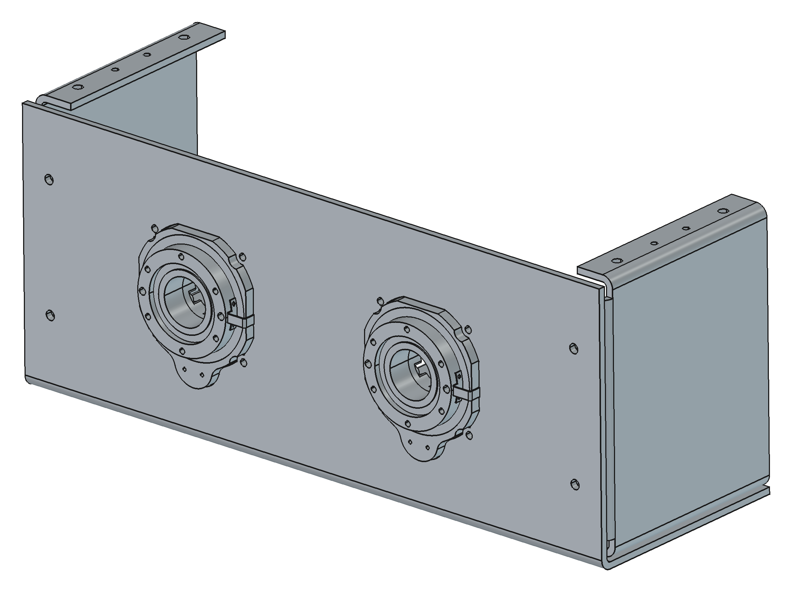

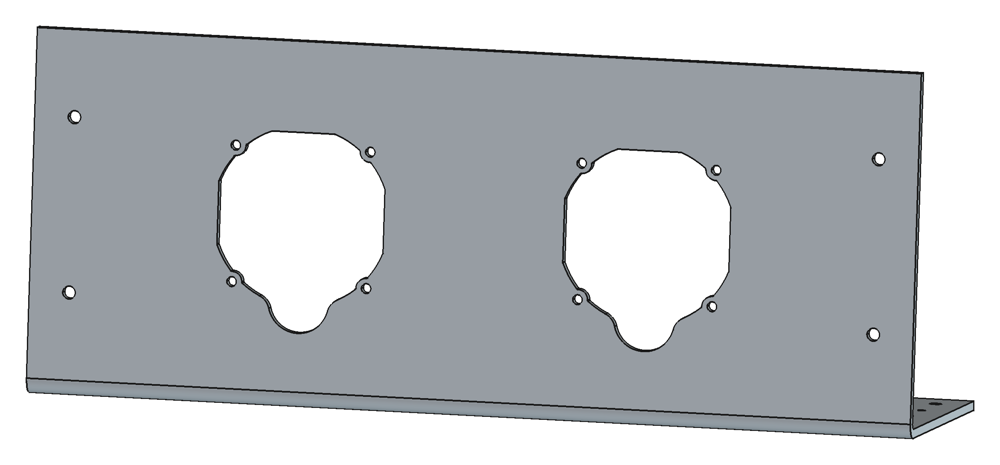

The silhouette cutout is a good example of *feeding the agent ground truth instead of a description*. We didn't describe the HRP85 housing; we sliced the vendor STEP at a band of heights, fused the slices, offset by 0.75 mm clearance and cut. When the vendor's geometry is the input, the vendor's geometry is what you get.

```python
def unit_features(hrp, p, style="silhouette"):
    z0 = p["flange_stop_z"] + 0.2                # just past the square base
    band = (z0, min(21.8, z0 + p["plate_thickness"]))
    faces = band_silhouette(hrp, band[0], band[1], n=5)   # slice + fuse
    faces = offset_faces(faces, p["cutout_clearance"])     # +0.75 mm
    pitch = p["flange_hole_pitch"] / 2.0
    holes = [(sx * pitch, sy * pitch) for sx in (-1, 1) for sy in (-1, 1)]
    return faces, holes
```

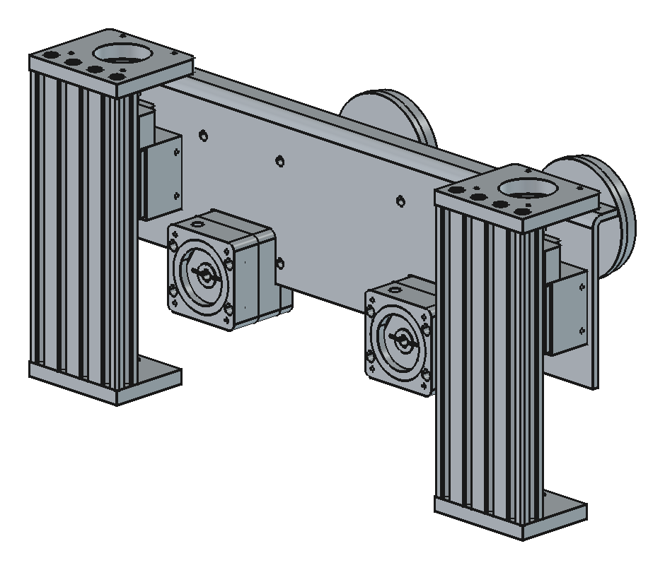

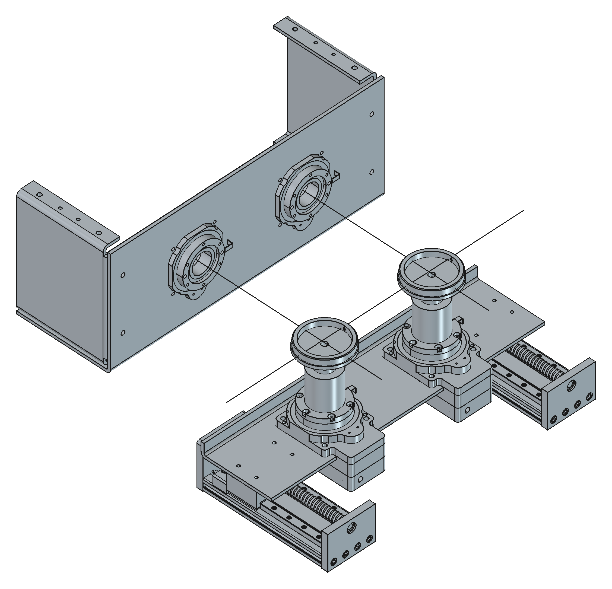

The whole thing — three sheet-metal parts, the assembly with vendor STEPs positioned, STEP exports for the sheet-metal vendor — is one macro of about a thousand lines and a `FLY` / `SPINDLE` / `COMMON` dict at the top. Changing the plate gauge from 4.0 to 4.7 mm when we discovered SendCutSend doesn't stock 4.0 was a one-line diff and a re-run.

---

## 5. How to actually work with the agent

This is the part people ask about. It's less about prompts than about *what you hand the agent and what you demand back*.

### Decompose until each ask is a part, not a machine
"Model the winder" is a losing prompt. "Cut two HRP85 silhouette pockets in a 460×180 plate at 180 mm centres, hollow bore stays open" is a winning one. If you can't state the acceptance check in one sentence, the ask is too big.

### Pin frames and datums in writing, first
Before any geometry: which way is +Z, where is the origin, which face is the "front." Write those into the macro header and into the agent's memory. Half the "wrong axis" / "still goofed" iterations we had early on were us not having done this.

### Feed ground truth, not descriptions
Vendor STEPs, measured datums, the real lamination DXF. Let the agent slice, measure and overlay them. Describing a part in prose is how you get a plausible wrong part.

### Demand verification scripts, not claims
This is the biggest lever. Every generator we have ends with checks the agent wrote for itself:

- **Boolean residual** — cut the pocket cutter from the plate, then check the cutter's volume inside the plate is 0.0.
- **Interference** — common volume between the HRP85 body and the plate must be zero; between arbor and riser must be exactly the seat volume.
- **Symmetry residual** — the "universal" side plate must equal its 180°-rotated self (`residual 0.0` is what let us ship one SKU ×2 instead of L + R).
- **Fixture clash** — for every stator SKU, does the guide wing hit the riser or arbor? (It does, for S32/S60, and the generator *says so* every run instead of us finding out in metal.)

An agent that must make a number come out zero behaves completely differently from one that must produce a convincing paragraph.

### Iterate on screenshots
Render, look, say what's wrong in human terms ("the leg should fold the other way," "spindle should be facing the fly"). The agent will map that onto the parameters. This loop is where the GUI still matters — but as an *inspection* tool, not an authoring tool. (Every image in this post was produced by a macro, `render_views.FCMacro`, that opens the generated documents and screenshots fixed views. The pictures are regenerable too.)

### Put DFM in the config, not in your head
"Casting: Ø5.0 minimum through-hole, no 90° internal corners." "Sheet metal: one part gets round holes, the mating part gets slots." "Left and right must be the same SKU." Once those are parameters or rules in the generator, they get applied to every part, every regeneration, forever. That's how the guide wing became a single flip-symmetric casting and the side plate became one part number ×2.

### Let the agent extend the schema — carefully
When the guide generator needed a per-SKU funnel width, the right move was `side_guide.tip_gap` in the stator YAML, defaulted to `shoe_width + 1.0`, with a comment saying who consumes it. That's a CRD. The wrong move would have been a second table of stator numbers inside the guide macro.

---

## 6. Repo hygiene that makes it sustainable

None of this survives without a little structure. Ours, per project:

```
fly/
  macros/            *.FCMacro generators (the source of truth)
  configs/           YAML the generators read (or a shared product repo)
  docs/              notes, DFM decisions, commercial references, img/
  external_imports/  vendor STEPs (HRP85, SXG5080, MGN9H) — never edited
  output/            what the macros write — gitignored, regenerable:
    <family>/<SKU>/<rev>/   cad-manifest.json, <id>.FCStd, step/<id>-<part>.step
  exports/           curated + committed: vendor bundles, latest STEP per part
  tools/             render_views.FCMacro and other non-geometry helpers
  README.md          how to regenerate, in one line
```

Rules we hold to:

- **`output/` is disposable.** If it's wrong, fix the macro or the config and re-run. Hand-editing a generated FCStd is the CAD equivalent of `kubectl edit` in prod — it works until the next apply.
- **Every revision folder carries a manifest.** `cad-manifest.json` records `design: "<id>@<config-sha>"`, the generator's sha, the resolved parameters actually used, and the check results. Same config + same generator ⇒ same design string ⇒ same geometry — that's the reproducibility contract that lets `output/` stay out of git. A new `rNNN` is allocated only when the config sha changes.
- **Commit a curated `exports/` anyway** (vendor bundles, the latest STEP per part, the manifest that produced them) so a collaborator without FreeCAD still gets files, and a STEP diff stays a cheap regression signal. Refresh it by copying from the current rev — never by hand.
- **Headless by default.** `freecadcmd macro.FCMacro` in a shell means the agent can run the generator itself, read the console, and iterate without a human clicking Run. Every macro also works from the GUI's macro menu.
- **One branch per feature, PR review = read the config diff.** Reviewing `deck_hole_xs = (-215, -70, 70, 215)` is a lot faster than reviewing a screenshot.
- **Memory for the agent.** The measured HRP85 datums, the OCC workarounds, "close and reopen the FCStd after regenerating or FreeCAD shows the stale one" — these live in the agent's project memory so the next session doesn't rediscover them.

---

## 7. War stories (the parts that weren't clean)

Being authoritative means being honest about the potholes.

**OCC offsets returning null.** `makeOffset2D` on a fused, sliced silhouette sometimes returns nothing, and when it works it may leave lazy `OffsetCurve` edges that the STEP writer mangles into unstitchable geometry. The fix that stuck: rebuild each edge as a true arc/line (`to_analytic`), fall back to a discretised B-spline if that fails, and *always* round-trip through STEP in the verification step so this class of bug can't hide.

**The oval-hole mystery.** Early fly plates came out with keyhole-shaped flange holes. The agent had (correctly) detected that a Ø6.6 clearance hole grazed the scalloped cutout edge and would leave a razor sliver, so it slotted the hole into the cutout — an honest DFM decision that looked like a bug. Resolution: tapped M6 (Ø5.0) holes, which never graze, and the slot logic stays as a safety net. The lesson: when the agent's output surprises you, ask *why* before overriding it.

**Hidden objects in headless saves.** An FCStd saved from `freecadcmd` has no `GuiDocument.xml`, so the GUI opens it with everything invisible and a "recompute?" prompt. Twelve lines write a minimal one into the zip and the file opens clean. Every headless generator we have now carries this.

```python
if not App.GuiUp:
    vps = "".join('<ViewProvider name="%s" expanded="0"><Properties Count="1" '
                  'TransientCount="0"><Property name="Visibility" '
                  'type="App::PropertyBool"><Bool value="true"/></Property>'
                  '</Properties></ViewProvider>' % o.Name for o in doc.Objects)
    xml = ("<?xml version='1.0' encoding='utf-8'?>\n<Document SchemaVersion=\"1\">"
           "<ViewProviderData Count=\"%d\">%s</ViewProviderData></Document>\n"
           % (len(doc.Objects), vps))
    with zipfile.ZipFile(fcstd, "a") as z:
        if "GuiDocument.xml" not in z.namelist():
            z.writestr("GuiDocument.xml", xml)
```

**The 29 banners.** When the agent added `side_guide.tip_gap` to the seven stator YAMLs, its append step wasn't idempotent — every re-run stacked another `# ── Side Wire Guides ─` comment header on the file. We shipped seven configs each carrying the same banner 29 times before anyone read the raw file. Harmless, embarrassing, and the exact lesson every infra team learns: **writers of config must be idempotent, and someone must diff the config, not just the outcome.** (Fixed in the same commit as this post.)

**Rearranged rails.** Placing a multi-solid vendor STEP (the SXG5080 axis) by overwriting each solid's `Placement` scrambled it — each solid already carried its own placement. Compose, don't overwrite: `part.Placement = pose.multiply(part.Placement)`.

**Fixture clash we can't parameterise away.** The S32 and S60 guide stations collide with the 70-square riser and Ø81 arbor. The generator flags it every run. The honest resolution is proportionate risers for small stators, which is a design decision, not a parameter tweak — and that's exactly the kind of thing that *should* surface as a red line in the console for a human to decide.

---

## 8. Limits, and where this is going

What this pattern does not do (yet):

- **Assembly constraints.** Our assemblies are posed by explicit placements the agent computes, not by mates. That's fine for a fixture; it's not how you'd manage a 400-part machine.
- **Tolerance stacks.** The generators know nominal dimensions and fit clearances we tell them. Nobody is doing statistical stack-up in a macro.
- **Aesthetics and ergonomics.** If the part has to look good or feel good, a human is still opening the GUI.
- **Wholesale novelty.** The agent is superb at "the same, but for S43" and at grinding through OCC edge cases. It is not going to invent the corkscrew conveyor. It *did* generate every flight of ours once we'd told it what a corkscrew conveyor is.

Where it's going: more of the shop's tooling migrates to generators every week, because a generator that exists is one nobody has to redraw. The vendor STEP libraries grow. The verification scripts get reused across generators. And the config schema — the stator YAML — slowly becomes the real product definition, with the CAD as one of several things compiled from it.

---

## 9. Take it with you

We've rolled the whole approach into a public repo, **[CAD_as_Code](https://github.com/Gwaihir-Robotics/CAD_as_Code)** — a Claude Code skill plus reference notes:

- the workflow above as a skill the agent loads (`cad-as-code`),
- FreeCAD headless recipes and the OCC workarounds we paid for,
- the verification-script patterns,
- a DFM checklist for sheet metal, casting and machined parts,
- a generator template + example config, and
- this post, with its images regenerable from a macro.

Clone it, symlink it into `~/.claude/skills/`, and the next time you type "make me a bracket," the agent will politely ask you which face is the front — and then write you a generator.

If you're building motors and want to talk tooling, [get in touch](/contact).

---

*Mason Hensley is the founder of Gwaihir Robotics. Every model in this post was generated by a FreeCAD macro written with Claude Code, and every screenshot by `render_views.FCMacro`.*
